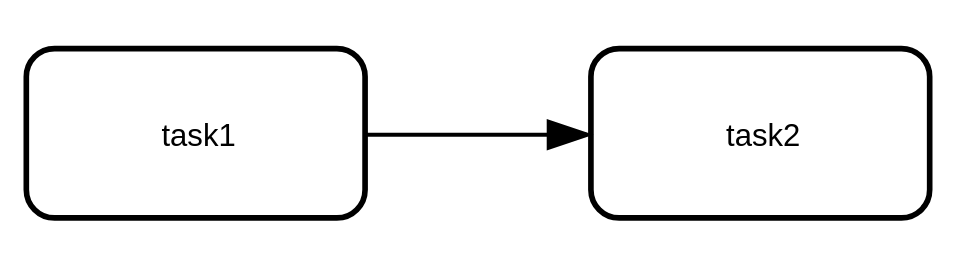

= bpmnLayoutGeneratoR

This library wraps the bpmn-layout-generator java library

== Prerequisites

`bpmnLayoutGeneratoR` depends on  http://rforge.net/rJava/:[rJava].

You must install a JDK to make `rJava` work. For the JDK installation, you can use for instance

* your OS package installer
* AdoptOpenJDK: https://adoptopenjdk.net/installation.html
* Adoptium: https://adoptium.net/installation.html

Once the JDK is installed, don't forget to run `R CMD javareconf`. See https://cran.r-project.org/doc/manuals/R-admin.html#Java-support

For more details, please refer to the  http://rforge.net/rJava/:[rJava documentation] and the https://github.com/s-u/rJava/blob/master/README.md[rJava GitHub README].

== Usage

Install the package. `bpmnLayoutGeneratoR-x.y.z` is the version you want to install, see the available branches on GitHub

[source,R]
----
# install the package
devtools::install_github("process-analytics/bpmn-layout-generators",  ref="bpmnLayoutGeneratoR-x.y.z", subdir="R/bpmnLayoutGeneratoR")
----

Then load data and generate the layout

[source,R]
----
# example source sequence_flow and flow_node
flow_node <- data.frame(id=c(1,2),node=c("task1","task2"),type=c("task","task"))
sequence_flow <- data.frame(id=1,from_id=1,to_id=2)

# Call the library and generate the diagram using "ASCII", "BPMN" or "SVG". Defaults to "BPMN".
diagram <- bpmnLayoutGeneratoR::generateBpmnLayout(flow_node, sequence_flow, "BPMN")
----

If you want to display the BPMN diagram, you can install the https://github.com/process-analytics/bpmn-visualization-R[bpmnVisualization] package and then run
[source,R]
----
bpmnVisualization::display(diagram)
----

The preview displays something like

== Build and release new version

* on the master branch create a branch named `bpmnLayoutGeneratoR-x.y.z` (replace with version)
* execute `make install` in the directory `R/bpmnLayoutGeneratoR`
* commit and push everything with title `release(R): bpmnLayoutGeneratoR-x.y.z`

