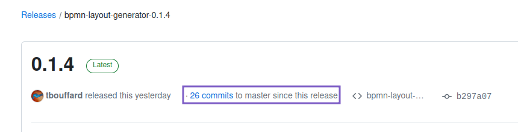
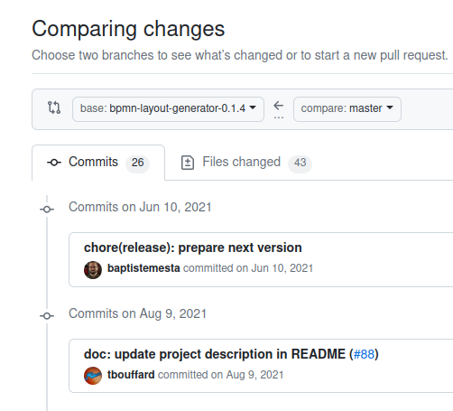

<h1 align="center">BPMN Layout Generators</h1>  

    

         
        
         
        <!-- no CONTRIBUTING guide available for now
         
        -->
         
         
    

**:warning: THIS IS AN EXPERIMENTAL PROJECT :warning:**

Tools for generating the graphical layout of the BPMN process (BPMNDI Graphical Model) in BPMN files.
They can be used with diagrams containing only the BPMN Semantic part or to replace the existing BPMNDI part.

## Implementations

> [!NOTE]
> The implementations are based or partially based on https://www.researchgate.net/publication/221542866_A_Simple_Algorithm_for_Automatic_Layout_of_BPMN_Processes

Available implementations:
- [java](java/README.md)
- [R](R/bpmnLayoutGeneratoR/README.adoc) This is only a wrapper of the java library

## Existing alternatives

Java
- https://github.com/camunda-consulting/code/tree/382f1521a4e9cd6bb92c2f9eacbe64a0e3835242/snippets/bpmndi-generator (latest available commit on 2020-04-08)
- https://github.com/camunda-consulting/migrate-to-camunda-tools/: tools to migrate from several vendors to Camunda, adaptation of the `bpmndi-generator`
- Camunda `fluent builder API`: https://docs.camunda.org/manual/7.9/user-guide/model-api/bpmn-model-api/fluent-builder-api/#generation-of-diagram-interchange

Javascript
- https://github.com/bpmn-io/bpmn-auto-layout/

## 🚀 Release how-to

> [!IMPORTANT]
> Follow the paragraphs in the order in which they are documented.

### Preparation

#### Decide on the value of the new version to be released

> [!NOTE]
> The versioning follows **semver** (be aware of the rules for 0.x.y versions).

Go to the page of the last [release](https://github.com/process-analytics/bpmn-layout-generators/releases/latest) to know what the latest version was.

Check for changes since the release of the last version:

Check the commit list to determine the type of version to release (major, minor or patch) based on changes and the value of the previous version (follow semver rules):

The version you've just determined should follow the form `x.y.z`, so keep this in mind for future tasks.

#### Prepare the release notes

The GitHub release will include an auto-generated release notes which is based on the labels of the merged Pull Requests.

Ensure that all merged PR included in the release are labelled. You can find the [unlabeled PR](https://github.com/process-analytics/bpmn-layout-generators/pulls?q=is%3Apr+sort%3Aupdated-desc+no%3Alabel+is%3Amerged) to easily labeled them.

### Perform the release

- release the java project
- then release the [R package](R/bpmnLayoutGeneratoR/README.adoc#release)

### Publish the release notes

When all updates have been completed, you are ready to publish a new release.

Go to the [release workflow](https://github.com/process-analytics/bv-experimental-add-ons/actions/workflows/release.yml) in GitHub Actions and run it by choosing the type of release.

This workflow:
- Creates a Git tag
- Triggers the publishing of the npm package
- Creates a draft GitHub release

The release workflow has initiated a new draft GitHub release, which needs to be updated and published :
- For more details about GitHub release, follow the [GitHub help](https://help.github.com/en/github/administering-a-repository/managing-releases-in-a-repository#creating-a-release):
- The release notes has been [automatically generated](https://docs.github.com/en/repositories/releasing-projects-on-github/automatically-generated-release-notes). Review and adjust it if necessary.
- Publish the GitHub release

## License

`bpmn-layout-generators` is released under the [Apache 2.0](LICENSE) license. \
Copyright &copy; 2020-present, Bonitasoft S.A.
